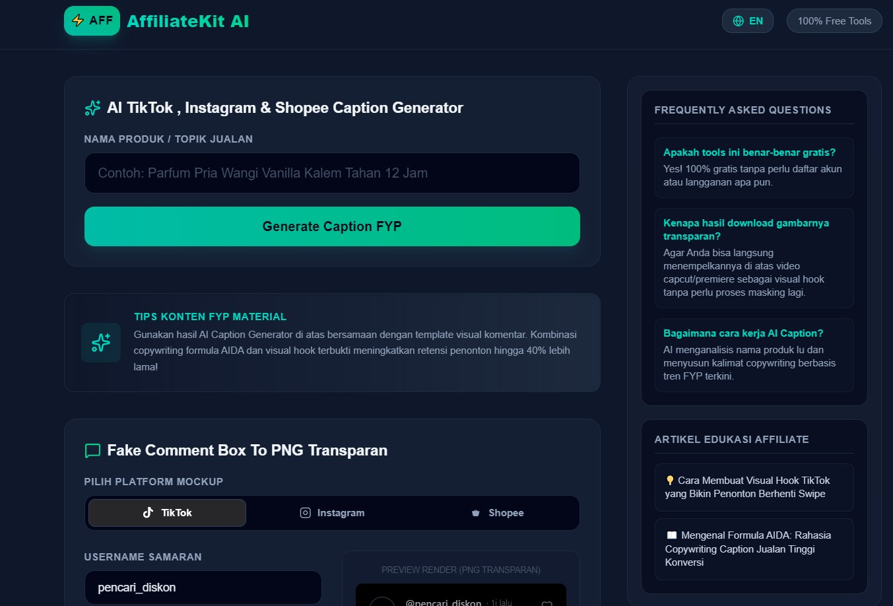
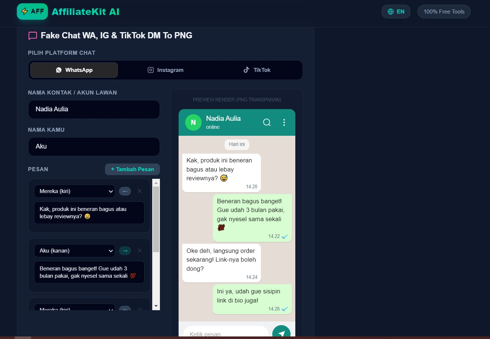

# 🤖 AffiliateKit AI

> All-in-one AI-powered toolkit designed for content creators and affiliate marketers.

AffiliateKit AI helps creators streamline the content creation workflow with AI-powered tools for generating captions, viral hooks, social proof assets, and more.

<p align="center">

<a href="https://affiliatekit.my.id">
  
</a>

</p>

---

## 📸 Preview

<p align="center">
  <a href="https://affiliatekit.my.id">
    
  </a>
</p>

<p align="center">
  <a href="https://affiliatekit.my.id">
    
  </a>
</p>

<p align="center">
  <i>Click the screenshots to visit the live application.</i>
</p>

---

## 🌐 Live Demo

### 👉 [Visit affiliatekit.my.id](https://affiliatekit.my.id)

Try the live application and explore the available AI-powered content creation tools.

---

## ✨ Features

### ✍️ AI Caption Generator

Generate engaging affiliate marketing captions using proven copywriting structures such as **AIDA (Attention, Interest, Desire, Action)**.

Designed to help creators produce promotional copy faster.

### 🪝 Viral Hook Generator

Generate attention-grabbing video hooks designed to improve the opening seconds of short-form content.

Useful for:

* TikTok
* Instagram Reels
* YouTube Shorts
* Affiliate product videos

### 💬 Fake Comment Generator

Generate transparent PNG comment assets that can be used as visual elements in video editing and content creation.

### 💬 Fake Chat Generator

Create realistic-looking chat conversation assets for creative content production, demonstrations, and visual storytelling.

### 🔍 SEO Ready

The platform includes SEO-focused configuration such as:

* Sitemap
* Robots.txt
* Metadata
* Search-engine-friendly page structure

---

## 🛠️ Tech Stack

| Technology       | Usage                              |
| ---------------- | ---------------------------------- |
| **Next.js 15**   | Application framework & App Router |
| **TypeScript**   | Type-safe development              |
| **Tailwind CSS** | UI styling                         |
| **Vercel**       | Deployment                         |
| **AI APIs**      | AI-powered content generation      |

---

## 📁 Project Structure

```text
AffiliateKit/
├── app/
│   ├── layout.tsx
│   ├── page.tsx
│   ├── globals.css
│   └── ...
│
├── components/
│   └── ...
│
├── public/
│   ├── images/
│   ├── logo/
│   └── favicon/
│
├── lib/
│   ├── ...
│   └── API utilities
│
├── screenshots/
│   ├── homepage1.jpg
│   └── homepage2.jpg
│
├── package.json
└── README.md
```

---

## 🚀 Getting Started

### 1. Clone the repository

```bash
git clone https://github.com/USERNAME/REPOSITORY_NAME.git
```

### 2. Enter the project directory

```bash
cd REPOSITORY_NAME
```

### 3. Install dependencies

```bash
npm install
```

### 4. Configure environment variables

Create a `.env.local` file and add the required API configuration.

```env
# Example
AI_API_KEY=your_api_key_here
```

> Never commit `.env.local` or expose API keys in the repository.

### 5. Run the development server

```bash
npm run dev
```

Open:

```text
http://localhost:3000
```

---

## 📦 Production Build

Build the application:

```bash
npm run build
```

Start the production server:

```bash
npm start
```

---

## ☁️ Deployment

The application is deployed using **Vercel**.

Deployment can be automated by connecting the GitHub repository to Vercel.

Every new production-ready commit can then be deployed automatically.

---

## 🎯 Project Goals

AffiliateKit AI was built to explore how AI and automation can simplify repetitive tasks in the affiliate content creation workflow.

The project focuses on:

* ⚡ Faster content production
* 🤖 AI-assisted copywriting
* 🎬 Short-form video content workflows
* 📈 Affiliate marketing productivity
* 🧰 Reusable creator tools
* 🚀 Building practical AI-powered products

---

## 📌 Project Status

**Status:** 🚀 Active Development

The platform is continuously being improved with new tools and features for content creators and affiliate marketers.

---

## 👨‍💻 Developer

Developed by **Andre Nurdiansyah**

**Focus:** Full-Stack Development · AI · Automation · Digital Products

🌐 [AffiliateKit AI](https://affiliatekit.my.id)
💼 [LinkedIn](https://www.linkedin.com/in/andre-nurdiansyah)
🐙 [GitHub](https://github.com/Andrenurdiansyah)

---

<p align="center">

Built with ❤️ using Next.js, TypeScript & AI

<br><br>

<a href="https://affiliatekit.my.id">
  🌐 affiliatekit.my.id
</a>

</p>
